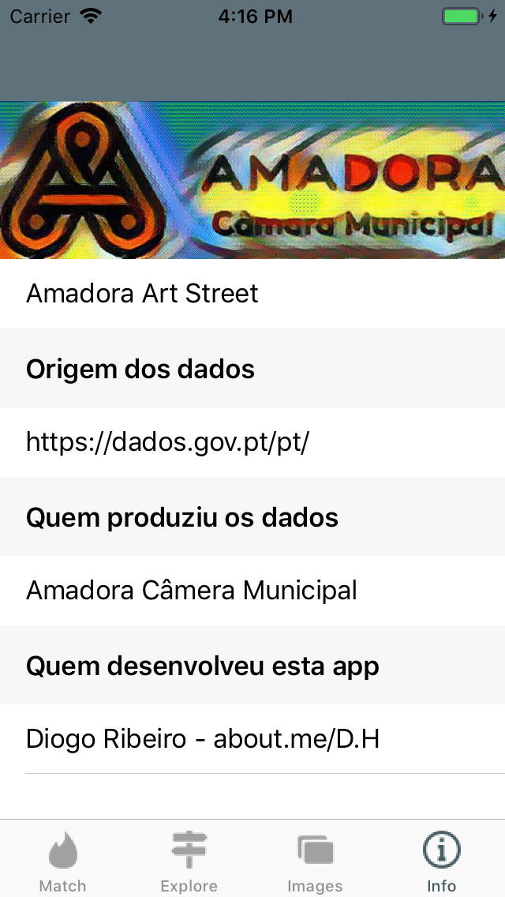
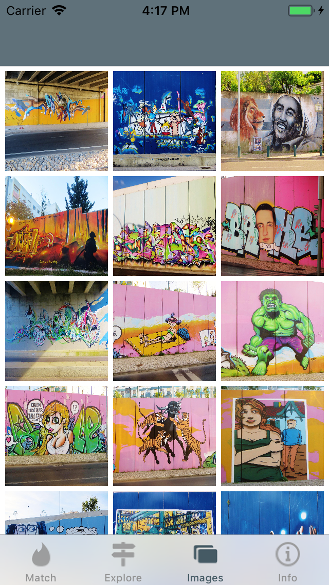
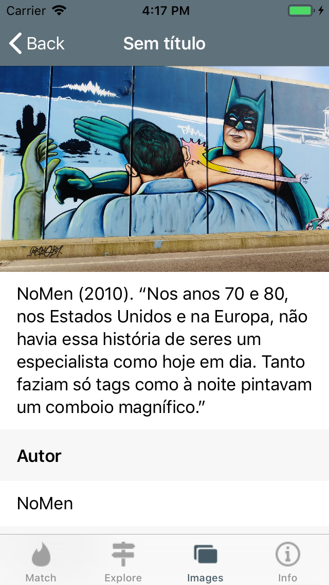
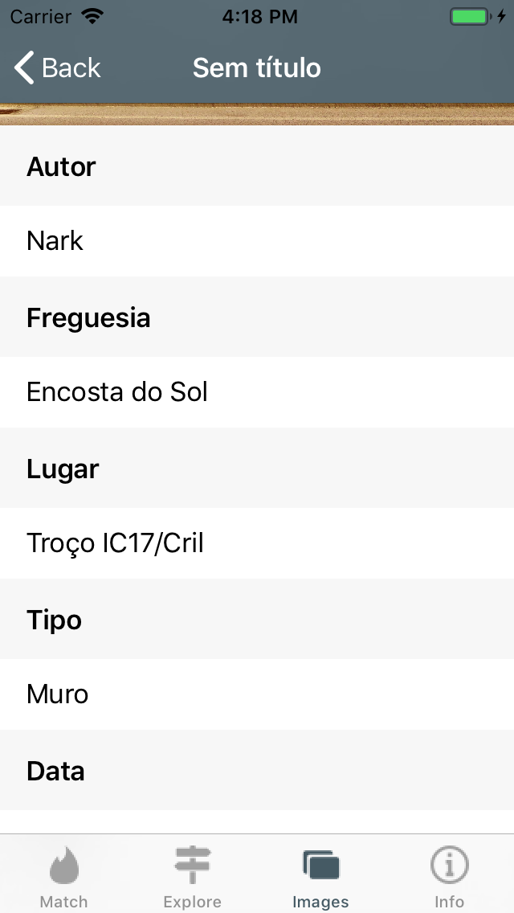
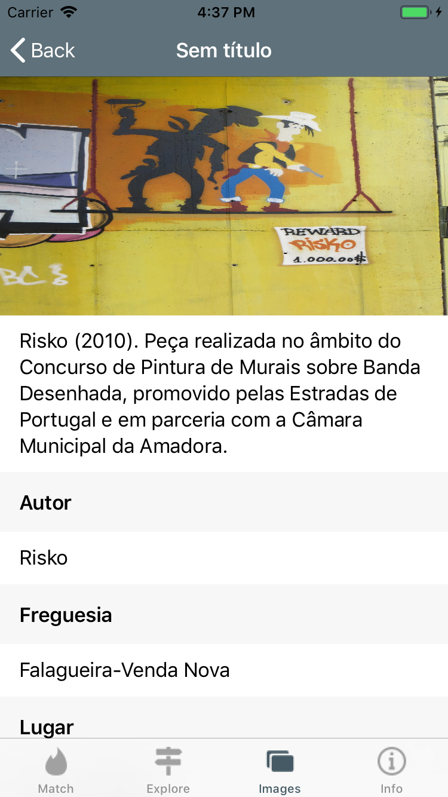
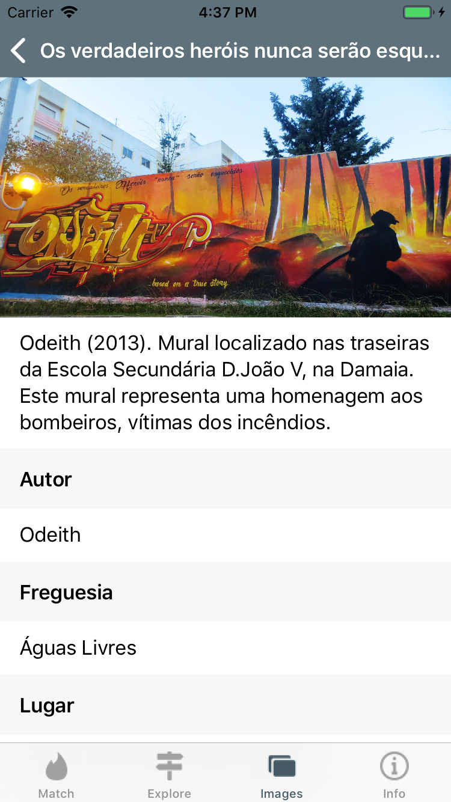
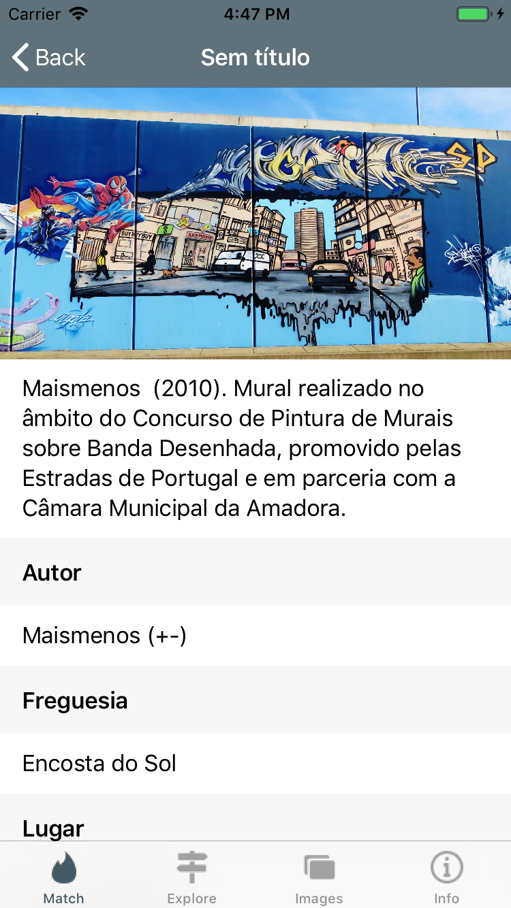
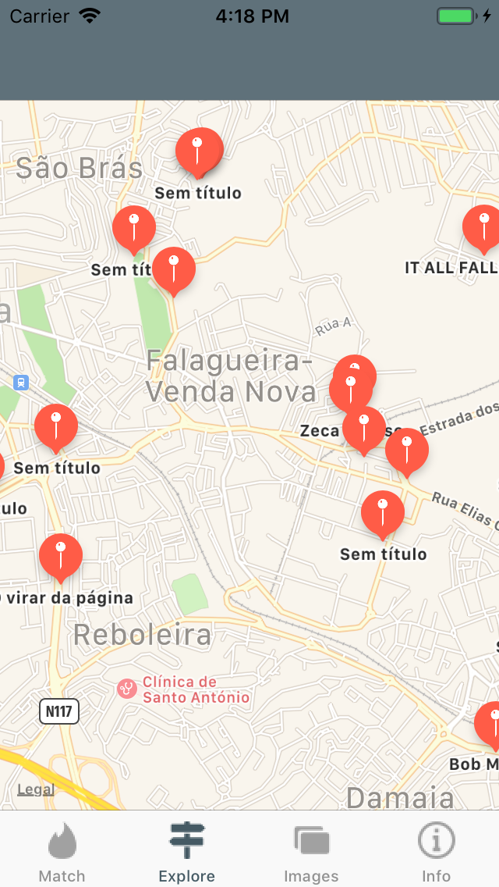
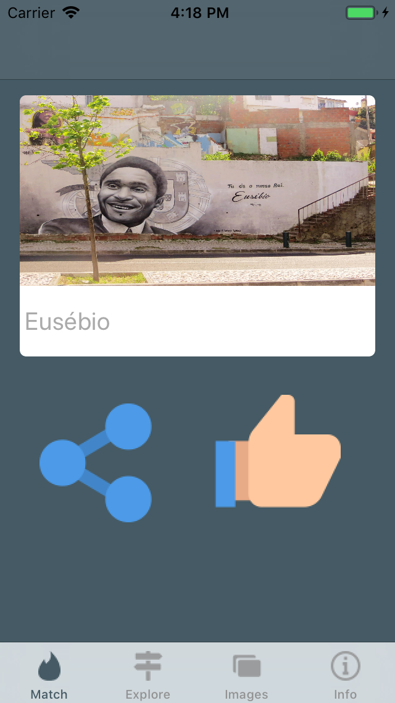
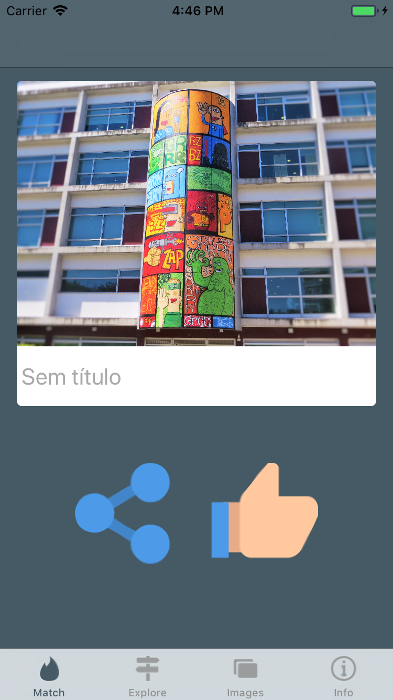

## CM Graffite Open souce App

 
 
Project created for having fun with Swfit 4. The data came from a open source website.

# Printcreen

 

 

 

 

 

 

 

# Notes

* http://www.cm-amadora.pt
* https://dados.gov.pt/pt/
* Original data: https://dados.gov.pt/pt/datasets/arte-urbana-1/
* The data is stored on the app. The file is called ArteUrbana.json
